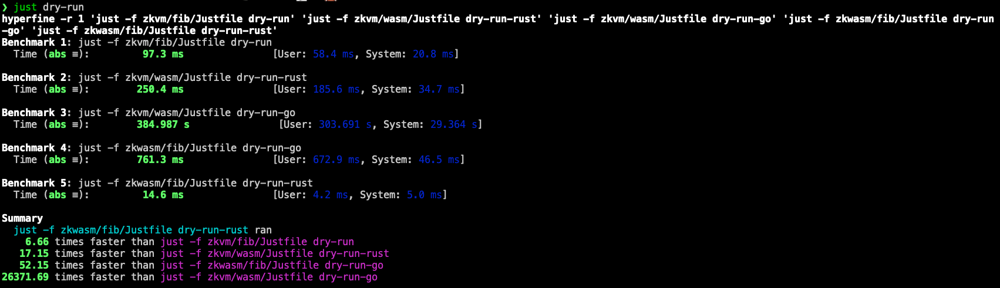

# zkvm-benchmark

Benchmarks between zkWasm and zkVM

## Dependencies

Before running, make sure your have installed the following tools:

* [just](https://github.com/casey/just): a command runner
* [hyperfine](https://github.com/sharkdp/hyperfine): a benchmarking tool
* wasm-opt: from [binaryen](https://github.com/WebAssembly/binaryen), for wasm to wasm optimization.
* delphinus-cli: from [zkWasm](https://github.com/DelphinusLab/zkWasm), to run zkWasm program, built from the latest main branch.
* risczero toolchain: from [risc0](https://github.com/risc0/risc0), to build zkVM program, built from v1.19.1 tag.
* lgo: an alias of the `go` binary built from [zkgo](https://github.com/ethstorage/go/tree/zkGo), for build go program to wasm, built from the latest zkGo branch.

## Install risczero toolchain

```sh
git clone https://github.com/risc0/risc0.git
cd risc0
git checkout v1.19.1 # checkout to the latest release
cargo install --path risc0/cargo-risczero
cargo risczero install # installs the latest RISC Zero toolchain
cargo risczero -V
rustup toolchain list --verbose | grep risc0
```

## Install zkGo compiler

```sh
git clone https://github.com/ethstorage/go.git
cd src
./all.sh
# output src/bin
mv go lgo
# set src/bin to your $PATH env
```

## Install `delphinus-cli`

```sh
git clone https://github.com/DelphinusLab/zkWasm.git
cd zkWasm
cargo build --release
# copy ./target/release/delphinus-cli to one of your $PATH directories
```

## Benchmark

Run Benchmarks with hyperfine.

```sh
just clean # optional
just build
just dry-run
```

Tested on my Mac Studio M1 Max



## Test manually

Build rust version fibonacci wasm program, and copy to zkVM/zkWasm folder.

```sh
cd rust/fib-wasm
just build
just opt
just copy
```

dry-run Rust and zkGo version fibonacci wasm program on zkVM.

```sh
cd zkvm/wasm
just build
just opt
just dry-run-rust
just dry-run-go
```

dry-run Rust and zkGo version fibonacci wasm program on zkWasm.

```sh
cd zkwasm/fib
just build
just dry-run-go
just dry-run-rust
```
